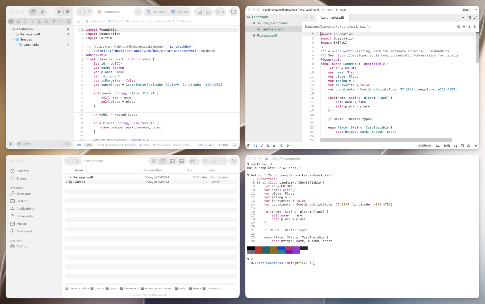
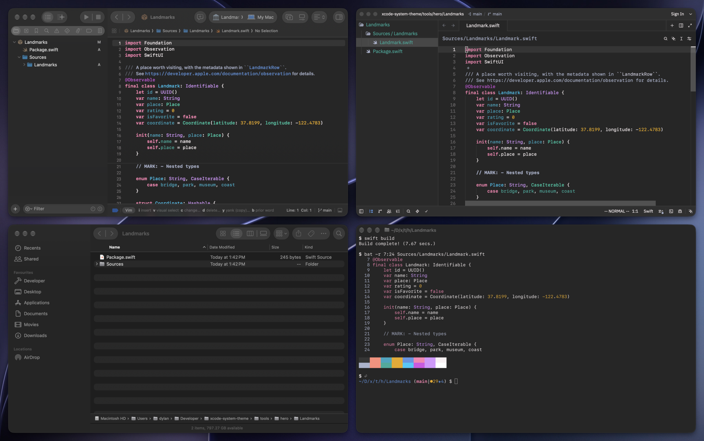
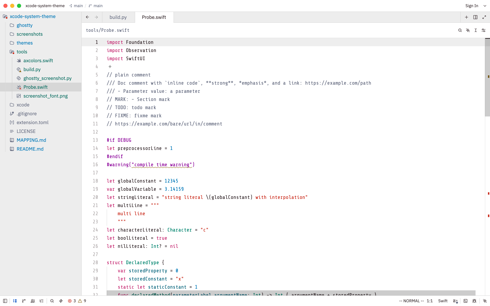
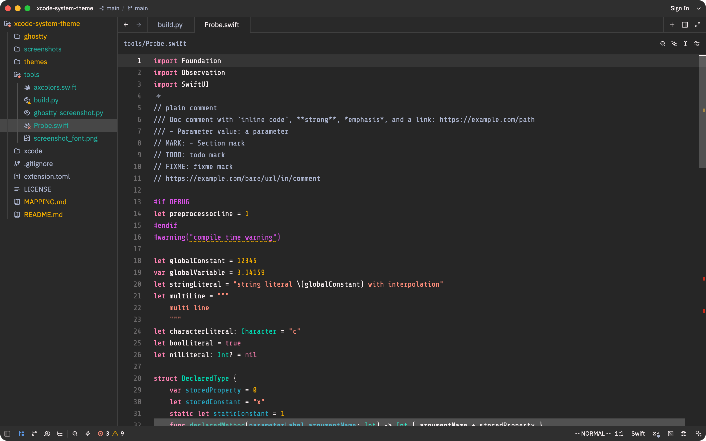
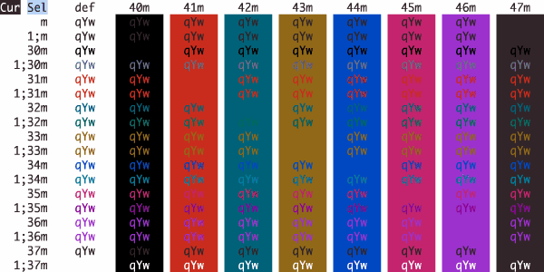
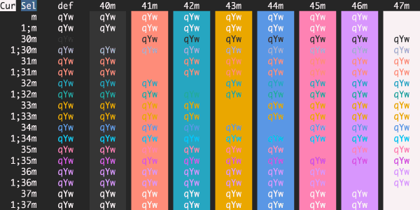

# Xcode System Theme

Xcode 27's default colors for [Ghostty](https://ghostty.org), [Zed](https://zed.dev), and [bat](https://github.com/sharkdp/bat), so your editor, terminal, and Xcode all agree with each other and with the rest of macOS.





## Why

In dark mode, Xcode, Finder, your editor, and your terminal each pick a slightly different near-black, and side by side the mismatch shows. This theme gives Ghostty and Zed the exact background Xcode 27 uses, `#262626`, and the same syntax colors, so every window you code in reads as one surface. Light mode gets the same treatment with Xcode's white editor and its warm near-black text. Both themes are opaque, so other windows have a stable background to match.

Existing Xcode ports convert the classic `.xccolortheme` files that Xcode has bundled since Xcode 11. Xcode 27 no longer draws those. Its default in both appearances is the Standard workspace theme, a procedural recipe of hues and intensities. Xcode can export the recipe but not the colors it produces, which is why no other port has them. This theme reads the resolved colors out of Xcode's running editor instead.

## Install

### Zed





Until the extension is in the Zed store, install it as a dev extension:

1. Clone this repo.
2. In Zed, open the command palette and run `zed: extensions`.
3. Click **Install Dev Extension** and pick the repo folder.

Then run `theme selector: toggle` and pick a theme, or set both appearances in `~/.config/zed/settings.json`:

```json
"theme": {
  "mode": "system",
  "light": "Xcode System Light",
  "dark": "Xcode System Dark"
}
```

### Ghostty





Copy the theme files into Ghostty's themes folder:

```sh
mkdir -p ~/.config/ghostty/themes
cp ghostty/* ~/.config/ghostty/themes/
```

Then in `~/.config/ghostty/config`:

```ini
theme = light:Xcode System Light,dark:Xcode System Dark
```

Ghostty switches live when the system appearance changes.

### bat

`bat` colors code with its own 24-bit themes by default, so a terminal theme never reaches it. `bat/Xcode System.tmTheme` maps syntax roles to palette slots instead, the same way the Ghostty files assign them, so `bat` follows whichever of the two themes the terminal is showing. Copy it into bat's themes folder and rebuild the cache:

```sh
mkdir -p "$(bat --config-dir)/themes"
cp "bat/Xcode System.tmTheme" "$(bat --config-dir)/themes/"
bat cache --build
```

Then make it the default in `$(bat --config-dir)/config`, usually `~/.config/bat/config`:

```
--theme="Xcode System"
```

## Notes

### Font

Xcode 27 uses SF Mono at 13 points with a line height of about 1.4, keywords in Semibold, and doc comments in SF Pro. The theme sets keyword weight to match, which needs a font with a bold face; Zed cannot switch fonts for doc comments. SF Mono ships inside Terminal.app and Xcode, and the Homebrew cask installs it system-wide:

```sh
brew install --cask font-sf-mono
```

Zed, in `settings.json`:

```json
"buffer_font_family": "SF Mono",
"buffer_font_size": 13,
"buffer_line_height": { "custom": 1.4 }
```

Ghostty, in its config:

```ini
font-family = SF Mono
font-size = 13
```

### Swift in Zed

Xcode colors Swift from what the compiler knows: system types differ from project types, declarations from uses, and attributes from macros. Zed's Swift extension colors from the grammar alone and does not make those distinctions, so out of the box the theme can only get so close. [A change to the extension](https://github.com/zed-extensions/swift) adds captures for them, plus Markdown in doc comments and bold marks. Until it is merged, the fork can be installed as a dev extension:

```sh
git clone -b xcode-like-highlights https://github.com/DylanVann/swift.git
```

Then run `zed: extensions`, click **Install Dev Extension**, and pick the cloned folder.

## Matching Finder and the rest of macOS

Turn off **System Settings > Appearance > Allow wallpaper tinting in windows**. By default macOS tints window backgrounds with a blur of your wallpaper, so Finder's gray drifts with the desktop, while Xcode's editor is opaque and never drifts. With tinting off, window surfaces settle on fixed grays: in light mode the editor and Finder's file area are both white and Xcode's panels match Finder's sidebar, and in dark mode the theme lands on the same `#262626` as Xcode's editor and Finder's sidebar. This is separate from Reduce transparency; the Dock, menu bar, and sidebars keep their glass.

Finder's dark file area is darker, `#1e1e1e`, on purpose. It is Apple's fixed content background color, and the 8 levels between it and an editor beside it read as a normal inset. [MAPPING.md](MAPPING.md) has the measured value of every surface.

## Provenance

**Syntax.** Xcode reports a foreground color for every token in its editor through the accessibility API. `tools/axcolors.swift` opens `tools/Probe.swift`, a Swift file that exercises every syntax role, and prints the sRGB components Xcode assigns to each one. `tools/build.py` turns those components into both theme files. Screen pixels agree with the extracted values to within one level in both modes. The Ghostty files document which role each ANSI slot carries.

**Surfaces.** Backgrounds, selection, current line, line numbers, and window chrome were measured from the screen, with captures converted from the display profile to sRGB. The Zed themes take their panels from Xcode's navigator and inspector and their title bar from Xcode's toolbar.

[MAPPING.md](MAPPING.md) traces every value to its source: an extracted component, a screen measurement, or a chosen offset. `tools/ghostty_screenshot.py` regenerates the Ghostty palette images, `tools/zed_screenshot.sh` the Zed window captures, and `tools/hero/hero.sh` the desktop shots at the top, by compositing each window onto the stored wallpaper, all from the sample package in `tools/hero/Landmarks`. The terminal pane shows the same file through `bat` with the Xcode System bat theme.

## License

MIT
